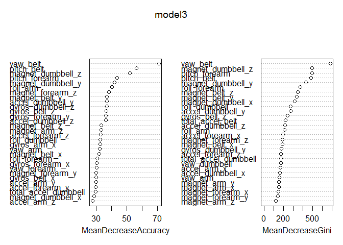
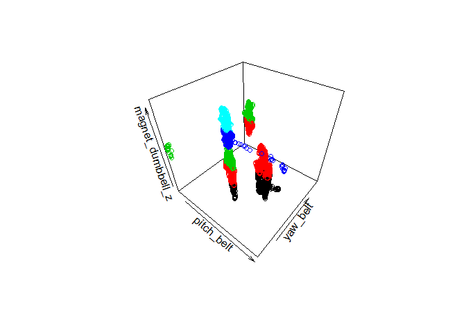

# Practical Machine Learning Course Project
Jennifer Butler  
October 7, 2015  


### Background
We can now collect a large amount of data about personal activity using devices that can be worn fairly unobtrusively on the body.  In this project, we examine data collected from accelerometers on the belt, forearm, arm, and dumbbell of 6 participants as they were asked to perform barbell lifts in 5 different ways (1x correctly and 4x incorrectly).  Our goal is to predict how the exercise was performed (the "classe" variable) using machine learning algorithms.

### Loading, Partitioning, Cleaning, and Preprocessing Data

#### *Loading data*
The training data for this project are available at <https://d396qusza40orc.cloudfront.net/predmachlearn/pml-training.csv> and the test data containing the 20 test cases are available at <https://d396qusza40orc.cloudfront.net/predmachlearn/pml-testing.csv>.


```r
TrainingDataURL <- "http://d396qusza40orc.cloudfront.net/predmachlearn/pml-training.csv"
TestDataURL <- "http://d396qusza40orc.cloudfront.net/predmachlearn/pml-testing.csv"
TrainingData <- read.csv(url(TrainingDataURL))
TestData <- read.csv(url(TestDataURL))
```

#### *Partitioning data*
First we partition our training data into **train** which we will use to train and fit our machine learning algorithm, and **trainTest** which we will use to validate our model and estimate out-of-sample error. Using a 60/40 partition, we end up with 11776 observations for the **train** sample and 7846 observations for the **trainTest** sample


```r
set.seed(1234)
inTrain <- createDataPartition(y=TrainingData$classe,p=0.6,list=FALSE)
train <- TrainingData[inTrain,]       ## 11776 obs of 160 vars
trainTest <- TrainingData[-inTrain,]  ## 7846 obs of 160 vars
```

#### *Cleaning data*
The **train** dataset contains NA's, blanks, and #DIV/0! values.  We convert them all to NA's in order to quickly remove them.  There are 100 columns that have between 11540 to 11776 missing values (most of the observations are missing).  


```r
train[train==""] <- NA
train[train=="#DIV/0!"] <- NA
table(colSums(is.na(train)))
```

```
## 
##     0 11540 11541 11543 11544 11547 11548 11549 11563 11581 11582 11584 
##    60    68     1     1     4     1     4     2     2     1     1     2 
## 11590 11591 11592 11776 
##     1     4     2     6
```

After removing them, we are left with 60 columns that have all 11776 observations.


```r
mTrain <- sapply(train,function(x) sum(is.na(x)))
train <- train[,-which(mTrain>0)] 
dim(train)
```

```
## [1] 11776    60
```

Next, we also remove columns 1 through 7 which are row indices, subject names, timestamps, and time windows.  These columns do not contain the relevant accelerometer information.  


```r
names(train[,1:7])
```

```
## [1] "X"                    "user_name"            "raw_timestamp_part_1"
## [4] "raw_timestamp_part_2" "cvtd_timestamp"       "new_window"          
## [7] "num_window"
```

After they are removed, we are left with 53 columns.


```r
train <- train[,-c(1:7)]
dim(train)
```

```
## [1] 11776    53
```

#### *Preprocessing by removing highly correlated variables*
With the exception of the **classe** variable (which is what we are trying to successfully predict), all of the other columns are either integers or numeric values.  In order to improve the performance of our algorithms, we now look for and remove any highly correlated (correlation coefficient above 0.9) variables in order to reduce multicollinearity. First we create a correlation matrix.  Then we use the **findCorrelation** function in the **caret** package to compare the absolute values of pair-wise correlations in the matrix - if two variables have a high correlation, it flags for removal the variable with the largest mean absolute correlation.  In our case it found 7 variables to be removed.    


```r
trainVars <- train[,-53]
corrMatrix <- cor(trainVars[sapply(trainVars, is.numeric)])
ToRemove <- findCorrelation(corrMatrix,cutoff=.9)
names(trainVars[ToRemove])
```

```
## [1] "accel_belt_z"     "roll_belt"        "accel_belt_y"    
## [4] "accel_belt_x"     "gyros_arm_y"      "gyros_forearm_z" 
## [7] "gyros_dumbbell_x"
```

```r
train <- train[,-ToRemove]
```

Our final cleaned up and minimally preprocessed **train** data now consists of 11776 observations with one outcome variable **classe** and 45 candidate features to be used in training our models.  


```r
dim(train)
```

```
## [1] 11776    46
```

Below is the list of the columns in the data we will use to train our model.


```r
names(train)
```

```
##  [1] "pitch_belt"           "yaw_belt"             "total_accel_belt"    
##  [4] "gyros_belt_x"         "gyros_belt_y"         "gyros_belt_z"        
##  [7] "magnet_belt_x"        "magnet_belt_y"        "magnet_belt_z"       
## [10] "roll_arm"             "pitch_arm"            "yaw_arm"             
## [13] "total_accel_arm"      "gyros_arm_x"          "gyros_arm_z"         
## [16] "accel_arm_x"          "accel_arm_y"          "accel_arm_z"         
## [19] "magnet_arm_x"         "magnet_arm_y"         "magnet_arm_z"        
## [22] "roll_dumbbell"        "pitch_dumbbell"       "yaw_dumbbell"        
## [25] "total_accel_dumbbell" "gyros_dumbbell_y"     "gyros_dumbbell_z"    
## [28] "accel_dumbbell_x"     "accel_dumbbell_y"     "accel_dumbbell_z"    
## [31] "magnet_dumbbell_x"    "magnet_dumbbell_y"    "magnet_dumbbell_z"   
## [34] "roll_forearm"         "pitch_forearm"        "yaw_forearm"         
## [37] "total_accel_forearm"  "gyros_forearm_x"      "gyros_forearm_y"     
## [40] "accel_forearm_x"      "accel_forearm_y"      "accel_forearm_z"     
## [43] "magnet_forearm_x"     "magnet_forearm_y"     "magnet_forearm_z"    
## [46] "classe"
```

### Building Machine Learning Algorithms
**Model 1: Quadratic discriminant analysis (qda)**
Because we have a categorical dependent variable and our predictors are all accelerometer information or calculations from such information (they are all integers or numeric rather than factors), we start with discriminant function analysis.  Linear discriminant analysis (LDA) is a classification method which attempts to find a linear combination of features that can separate two or more classes.  In our case, we will use quadratic discriminant analysis (QDA) which is a generalized version of LDA.  QDA does **not** require the assumption that the measurements for each class be normally distributed with equal variances, and it works well with decision boundaries that may not be linear.  Our **model1** yields an accuracy of 87.5%.


```r
set.seed(1234)
model1 <- train(classe~.,data=train,method="qda")
model1
```

```
## Quadratic Discriminant Analysis 
## 
## 11776 samples
##    45 predictor
##     5 classes: 'A', 'B', 'C', 'D', 'E' 
## 
## No pre-processing
## Resampling: Bootstrapped (25 reps) 
## 
## Summary of sample sizes: 11776, 11776, 11776, 11776, 11776, 11776, ... 
## 
## Resampling results
## 
##   Accuracy   Kappa      Accuracy SD  Kappa SD   
##   0.8753633  0.8427536  0.005489626  0.006882983
## 
## 
```

**Model 2: Recursive partitioning (rpart)**
We next turn to recursive partitioning (rpart) which attempts to create a decision tree by splitting a population into sub-populations an indefinite number of times until a particular stopping criterion is reached.  One criticism of **rpart** is that it does not work so well with continuous variables.  As you can see, the accuracy of the optimal tree from **model2** was only 51.5%!


```r
set.seed(1234)
model2 <- train(classe~.,data=train,method="rpart")
model2
```

```
## CART 
## 
## 11776 samples
##    45 predictor
##     5 classes: 'A', 'B', 'C', 'D', 'E' 
## 
## No pre-processing
## Resampling: Bootstrapped (25 reps) 
## 
## Summary of sample sizes: 11776, 11776, 11776, 11776, 11776, 11776, ... 
## 
## Resampling results across tuning parameters:
## 
##   cp          Accuracy   Kappa      Accuracy SD  Kappa SD  
##   0.02954438  0.5149537  0.3760062  0.03055216   0.04685150
##   0.03203607  0.5040433  0.3615663  0.03117759   0.04854665
##   0.06677148  0.3282123  0.0744130  0.08304904   0.13517790
## 
## Accuracy was used to select the optimal model using  the largest value.
## The final value used for the model was cp = 0.02954438.
```

**Model 3: Random forest (randomForest)**
We then use random forest next because it is an ensemble learning method of classification that builds many trees using bootstrap random sample subsets of the data (rather than a single tree using the entire sample) for better performance. A good explanation of how random forests work can be found at <https://www.stat.berkeley.edu/~breiman/RandomForests/cc_home.htm#workings>. 


```r
set.seed(1234)
model3 <- randomForest(classe~.,data=train,importance=TRUE,proximity=TRUE)
model3
```

```
## 
## Call:
##  randomForest(formula = classe ~ ., data = train, importance = TRUE,      proximity = TRUE) 
##                Type of random forest: classification
##                      Number of trees: 500
## No. of variables tried at each split: 6
## 
##         OOB estimate of  error rate: 0.68%
## Confusion matrix:
##      A    B    C    D    E class.error
## A 3344    2    0    0    2 0.001194743
## B   17 2256    6    0    0 0.010092146
## C    0   18 2033    2    1 0.010223953
## D    0    0   21 1906    3 0.012435233
## E    0    0    2    6 2157 0.003695150
```


The accuracy of this algorithm is 99.3%.  This is the algorithm we will choose to validate with the  **trainTest** sample that we partitioned out earlier.  


```r
sum(diag(model3$confusion))/sum(model3$confusion)
```

```
## [1] 0.9932033
```

**Examining the machine learning algorithm using random forest**  
Let's take a closer look at our algorithm.  Below we can examine the features that the algorithm found to be important.  The "mean decrease accuracy" tells us how much accuracy is lost if we remove that predictor.  Therefore variables that have larger mean decreases in accuracy are more important.  The "mean decrease GINI" tells us the relative contribution of each predictor to the purity of the resulting nodes of the tree.  Therefore, variables that result in higher losses in purity (mean decrease GINI) are also considered more important to the algorithm.


```r
varImpPlot(model3)
```

 

Below we display a 3-D plot of three of the most important predictors: "yaw_belt", "pitch_belt", and "magnet_dumbbell_z".


```r
scatter3D(x=train$pitch_belt,y=train$yaw_belt,z=train$magnet_dumbbell_z,
          col=train$classe,colkey=FALSE,
          xlab="pitch_belt",ylab="yaw_belt",zlab="magnet_dumbbell_z")
```

 

### Cross-Validation and Out-of-Sample Error
The **trainTest** sample was a 40% partition from the original **TrainingData** and it contains 7846 observations of 160 variables.  The **trainTest** sample is completely untouched - we have not done any cleaning or preprocessing on this partition.  We will use this partition as our cross-validation to test **model3**, our machine learning algorithm which we trained using **randomForest**, and estimate our out-of-sample error.  


```r
predictions <- predict(model3,newdata = trainTest)
confusionMatrix(predictions,trainTest$classe)
```

```
## Confusion Matrix and Statistics
## 
##           Reference
## Prediction    A    B    C    D    E
##          A 2232   14    0    0    0
##          B    0 1498   14    0    0
##          C    0    6 1351   13    2
##          D    0    0    3 1271    2
##          E    0    0    0    2 1438
## 
## Overall Statistics
##                                           
##                Accuracy : 0.9929          
##                  95% CI : (0.9907, 0.9946)
##     No Information Rate : 0.2845          
##     P-Value [Acc > NIR] : < 2.2e-16       
##                                           
##                   Kappa : 0.991           
##  Mcnemar's Test P-Value : NA              
## 
## Statistics by Class:
## 
##                      Class: A Class: B Class: C Class: D Class: E
## Sensitivity            1.0000   0.9868   0.9876   0.9883   0.9972
## Specificity            0.9975   0.9978   0.9968   0.9992   0.9997
## Pos Pred Value         0.9938   0.9907   0.9847   0.9961   0.9986
## Neg Pred Value         1.0000   0.9968   0.9974   0.9977   0.9994
## Prevalence             0.2845   0.1935   0.1744   0.1639   0.1838
## Detection Rate         0.2845   0.1909   0.1722   0.1620   0.1833
## Detection Prevalence   0.2863   0.1927   0.1749   0.1626   0.1835
## Balanced Accuracy      0.9988   0.9923   0.9922   0.9938   0.9985
```

We can see above that the **accuracy** of our algorithm on **trainTest** is **0.9929** (nearly identical to the accuracy of the data we trained on which was 0.9932033) with a 95% confidence interval between 0.9907 and 0.9946.  In other words, we can be 95% confident that our accuracy for correctly predicting **classe** is between 99.1% and 99.5%.

The OOB (out-of-bag) estimate of error rate on the data we trained on was 0.68% or 0.0068 (see summary of **model3** above).  The **randomForest** function does cross-validation internally as part of its run by using bootstrap random samples where about one-third of the cases are left out ("out-of-bag") for each of 500 trees that it builds (using the function's default number of trees).  Therefore we expect the OOB error rate of 0.0068 to be close to the actual out-of-sample error rate on the **trainTest** data.  Looking at the confusion matrix for our predicted values, it turns out that the OOB estimate error rate is indeed very close to our actual **out-of-sample error** of 1-accuracy, or 1-0.9929, which is **0.0071**.

### Application of the Final Model to the 20 Test Cases
Finally, we will apply our machine learning algorithm to the 20 test cases supplied in the **TestData** sample.  Based on the performance of our algorithm on both **train** (the data we trained on) as well as **trainTest** (the validation data we tested our algorithm on), we expect to be able to correctly predict upwards of 99% of the test cases.


```r
predictionsTestCases <- predict(model3,newdata = TestData)
predictionsTestCases
```

```
##  1  2  3  4  5  6  7  8  9 10 11 12 13 14 15 16 17 18 19 20 
##  B  A  B  A  A  E  D  B  A  A  B  C  B  A  E  E  A  B  B  B 
## Levels: A B C D E
```

We follow the instructions to create 20 text files each with a single capital letter and submit each file individually on the course project submission website.  We get a "You are correct!" feedback for each submission and find that we have successfully classified all 20 test cases.
